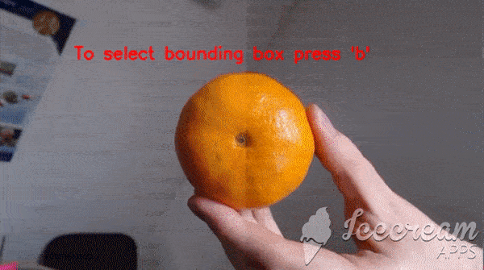

# OpenCV-Object-Tracking
Scripts for object tracking and motion detection using Python and OpenCV

## Object Tracker

Object tracker based on OpenCV KCF tracker. The program can capture video from a source or from a webcam.
Script parameters:

#### -v 

is your video path. In default case run your webcam.

#### -b 

is your preset bounding box. Four integers separated by comma: 

(x-coordinate of top left corner),(y-coordinate of top left corner),(width),(height)

In default case you can pick area by mouse.

#### -f 

is frame number for start tracking if -b is predetermined. In default case is 0.

Example:

```
$python object_tracker.py -v videos/fruit.mp4 -b 235,100,180,180 -f 10
```

Test example:



  
## Motion Tracker

Motion tracker based on OpenCV. 

Motion detection is based on subtracting an assumed background from the current frame. The image is taken as a background a few frames earlier, the hyperparameter is set in the script. Its value affects the speed threshold of the detected objects.

```python
DELAY = 20
```

To customize the program for a specific case, you also need to find a balance between the threshold of the minimum change in the frame and the threshold of the minimum detection area. These parameters are set in the function as threshold and area, respectively.

```python
drawContours(background, frame, threshold, area)
```
Script parameters:

#### -v 

is your video path. In default case run your webcam.

Example:

```linux
$python motion_tracker.py -v videos/traffic.mp4 
```

Test example:


